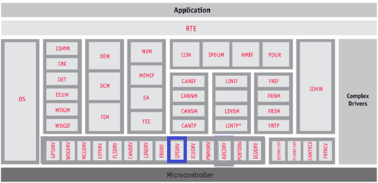
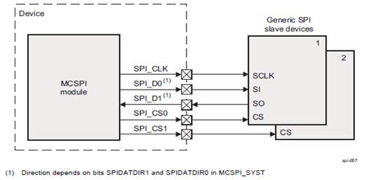

# 💚 Introduction Spi MCAL AUTOSAR MODULE 💛

## 👉 Introduction and Summary

### 1️⃣ Introduction

+ Ở repo này mình sẽ nói overview về kiến thức module Spi. Version Autosar trong repo này là 4.3.1 nhé.

### 2️⃣ Summary

Nội dung của bài viết gồm có những phần sau nhé 📢📢📢:
- [I. Introduction and Summary](#👉-introduction-and-summary)
    - [1. Introduction](#1️⃣-introduction)
    - [2. Summary](#2️⃣-summary)
- [II. Contents](#👉-contents)
- [III. Reference](#📌-reference)

## 👉 Contents

### Introduction
+ This document details AUTOSAR BSW Eth module implementation
  - Supported AUTOSAR Release : 4.3.1
  - Supported Configuration Variants : Pre-Compile & Link Time & Post Build

### Overview
+ The figure below depicts the AUTOSAR layered architecture as 3 distinct layers, Application, Runtime Environment (RTE) and Basic Software (BSW). The BSW is further divided into 4 layers, Services, Electronic Control Unit Abstraction, MicroController Abstraction (MCAL) and Complex Drivers.

​

     

+ MCAL is the lowest abstraction layer of the Basic Software. It contains internal drivers that are software modules that interact with the Microcontroller and its internal peripherals directly.SPI driver is part of the communication Drivers module which is part of the Basic Software. SPI driver diagram below shows the position of the SPI driver in the AUTOSAR Architecture.The Spi driver provides services for basic communication with external components. These components can be used by an application. The main tasks of the Spi are:
  - Handle the Spi hardware units onboard.
  - Handle data transmission to the components connected via Spi.
  - Take care of the settings required by external components (baud rate etc.)

​

     

### Spi Overview

​

     

+ The MCSPI modules include the following main features:
  - Serial clock with programmable frequency, polarity, and phase for each channel.
  - Wide selection of SPI word lengths, ranging from 4 to 32 bits.
  - SPI configuration per channel. This means, clock definition, polarity enabling and word width can be configured individually.
  - Built-in FIFO available for a single channel.
  - Support for the following interrupts and status, with masking: Interrupt for FIFO threshold levels. Rx empty, TX empty etc

### Features Supported
+ Configure Spi with
  - External devices
  - Channels
  - Jobs
  - Sequences
+ Initialization and de-initialization of MCSPI hardware units and callback functions.
+ Configure error detection (DEM and DET).
+ Configure implementation features like
  - Spi scalability level(s).
  - Spi channel buffers
  - Spi Interrupts
  - Spi frame transfers with 8 or 16bit clock frames
+ Select simple or extended API
+ Interruptible Sequences.
+ All four modes of SPI transfer (mode 0 to mode 3).
+ Configurable start bit enable, chip select idle time delay. Chip select maps to single channel, not leveraging the multi- channel feature which IP provides.
+ Internal clock divider.
+ Concurrent transfer of MCSPI devices.
+ Enhanced (Synchronous/Asynchronous) SPI Handler/Driver for MCSPI channels.
+ Concurrent synchronous, asynchronous transfer

### Features Not Supported
+ Supports only MSB based transfer modes(LSB is not supported).
+ Data width more than 32 bits.
+ In async mode of transfer only interrupt/polling based mode is supported. DMA based transfer mode is not supported.
+ Supports additional configuration parameters, refer section generates global (Global Variables)
+ Some SPI instances of device variants TDA4x does not support master mode and are not pinned out externally.

### Constraints
+ A job could belong to several sequences but can't be active at the same time i.e. a job queued in a sequence cannot be queued via another sequence. This is a design limitation to reduce driver complexity.
+ A channel could belong to several sequences or jobs but can't be active at the same time i.e. a channel in a job in a sequence cannot be part of another active job or sequence. This is a design limitation to reduce driver complexity.
+ Non-Interruptible sequence applies only within a HW unit. If a sequence is started, another high priority job belonging to another sequence cannot interrupt the job belonging to the same hardware unit. But the job can be scheduled ahead of another pending job of the started sequence if it belongs to another HW queue. This is illustrated in below example

### Dependencies to other modules
+ SPI peripherals may depend on the system clock, prescaler(s) and PLL. Thus, changes of the system clock (e.g. PLL on , PLL off) may also affect the clock settings of the SPI hardware.
+ The SPI Handler/Driver module does not take care of setting the registers which configure the clock, prescaler(s) and PLL in its init function. This has to be done by the MCU module.
+ Depending on microcontrollers, the SPI peripheral could share registers with other peripherals. In this typical case, the SPI Handler/Driver has a re-lationship with MCU module for initialising and de-initialising those registers.
+ If Chip Selects are done using microcontroller pins the SPI Handler/Driver has a relationship with PORT module. In this case, this specifica-tion assumes that these microcontroller pins are directly accessed by the SPI Han-dler/Driver module without using APIs of DIO module. Anyhow, the SPI depends on ECU hardware design and for that reason it may depend on other modules.

### Scalability Levels in SPI Driver:
+ LEVEL 0, Simple Synchronous SPI Handler/Driver: the communication is based on synchronous handling with a FIFO policy to handle multiple accesses. Buffer usage is configurable to optimize and/or to take advantage of HW capabilities. A simple synchronous transmission means that the function calling the transmission service is blocked during the ongoing transmission until the transmission is finished.
+ LEVEL 1, Basic Asynchronous SPI Handler/Driver: the communication is based on asynchronous behavior and with a Priority policy to handle multiple accesses. Buffer usage is configurable as for “Simple Asynchronous” level. An asynchronous transmission means that the user calling the transmission service is not blocked when the transmission is on-going. Furthermore, the user can be notified at the end of transmission.
+ LEVEL 2, Enhanced (Synchronous/Asynchronous) SPI Handler/Driver: the communication is based on asynchronous behavior or synchronous handling, using either interrupts or polling mechanism selectable during execution time and with a Priority policy to handle multiple accesses. Buffer usage is configurable as for other levels

### Priority Handling and Job Queuing Operations
Priority mechanism is implemented using a pure software function as hardware priority mechanism is not supported by the SPI module. Priority is supported at job level in a sequence. As per the AUTOSAR SPI HandlerDriver SWS jobs are scheduled in order of priority. The priority of jobs determines their scheduling even across sequences as long as a sequence is marked as interruptible.The internal implementation of job priority based scheduling is based on priority queue implemented as a doubly linked list. All jobs are queued into a work queue per hardware unit. The hardware services the next job in the work queue by de-queuing from this work queue. The work queue implementation ensures the highest priority job is de-queued always.

## 📌 Reference

[0] https://www.autosar.org/fileadmin/user_upload/standards/classic/4-3/AUTOSAR_SWS_SpiDriver.pdf

[1] https://youtu.be/G-Y27cojQb8?si=WphEMRTopmP83CDc

[2] https://autosarthonv.github.io/

[3] https://software-dl.ti.com/jacinto7/esd/processor-sdk-rtos-jacinto7/08_01_00_11/exports/docs/mcusw/mcal_drv/docs/drv_docs/index.html

[4] https://www.youtube.com/watch?v=YeAsBK0K0F0&list=PLE9xJNSB3lTFFjw2Or_ayjf-CSX0VypIE

