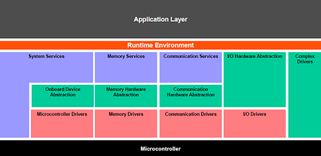
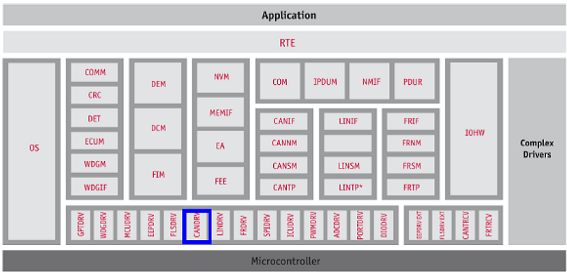
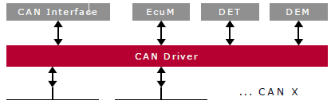
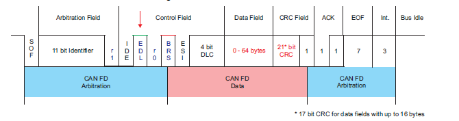

# 💚 Introduction MCAL AUTOSAR 💛

## 👉 Introduction and Summary

### 1️⃣ Introduction

+ Chém gió thành bão

### 2️⃣ Summary

Nội dung của bài viết gồm có những phần sau nhé 📢📢📢:
- [I. Introduction and Summary](#👉-introduction-and-summary)
    - [1. Introduction](#1️⃣-introduction)
    - [2. Summary](#2️⃣-summary)
- [II. Contents](#👉-contents)
    - [1. Hướng dẫn sử dụng MCAL Configurator](#1️⃣-Hướng-dẫn-sử-dụng-MCAL-Configurator)
    - [2. Mcal Module](#2️⃣-Mcal-Module)
- [III. Reference](#📌-reference)

## 👉 Contents

### 1️⃣ Hướng dẫn sử dụng MCAL Configurator
***MCAL sử dụng Elektrobit Tresos để cấu hình các mô-đun MCAL.***
+ Định nghĩa tham số ECU của mô-đun MCAL được ghi lại ở định dạng Elektrobit xdm.
+ Các mô-đun MCAL được cung cấp dưới dạng plugin EBtresos.
+ Việc cấu hình các mô-đun MCAL có thể được thực hiện bằng Trình chỉnh sửa cấu hình Elektrobit Tresos.
+ Sau khi quá trình cấu hình hoàn tất, mã có thể được tạo ra cho các biến thể trình điều khiển được hỗ trợ.
+ Một mô-đun điển hình sẽ bao gồm các tệp sau:
  + 1. Định nghĩa mô-đun
    - Module.xdm : Mô tả mô-đun có thể được dùng để tạo ra file arxml
    - Module.epd
  + 2. Code generate
    - Module_Cfg.h : Cung cấp mẫu để tạo tệp tiêu đề.
    - Module_Cfg.c : Cung cấp mẫu để tạo cấu hình mô-đun trong quá trình biên dịch.
    - Module_Lcfg.c : Cung cấp mẫu để tạo cấu hình mô-đun Link Time.
    - Module_PBcfg.c : Cung cấp mẫu để tạo cấu hình mô-đun sau khi biên dịch.
  + 3. Module_Bswmd.arxml: Chi tiết mô-đun như cách sử dụng ngăn xếp, tệp, vùng độc quyền, v.v...
  + 4. MANIFEST.MF: Thông tin cấp phép của mô-đun (bắt buộc đối với EB)
  + 5. plugin.xml: Mô tả mô-đun sẽ được sử dụng bởi giao diện người dùng đồ họa (GUI) của EB Tresos Studio.

***Tạo nội dung bằng giao diện dòng lệnh Tresos Studio.***
+ Nội dung config của mô-đun MCAL có thể được tạo bằng lệnh tresos và cấu hình được đề xuất cho một mô-đun nhất định. Các bước sau đây mô tả chi tiết trình tự các thao tác cần thiết. Dựa trên SOC, bạn cần chọn các plugin tương ứng.
+ Lệnh dưới đây có thể được sử dụng
```bash
 C:\EB\tresos\bin\tresos_cmd.bat -Decuid=mcal_example_config_1 -Dtarget=R5F -Dderivate=J721E legacy generate -n Can -g Can_HuLa -oc:\program\Can.xdm
```
+ Các tùy chọn được sử dụng là
  - -Decuid: Specifies the ID of the imported ECU
  - -Dtarget: Defines the target architecture ECU
  - -Dderivate: Defines the targets derivate
  - -n: Specifies the name of the module configurations of the configuration files to load
  - -g: Module Id
  - -o: Sets the directory to which the generated files are written

***Tạo EPD và ARXML***
+ EB Tresos cung cấp commandline để chuyển đổi các tệp XDM thành định nghĩa mô-đun EPD hoặc ARXML

+ **Tạo EPD**
1. Open cmd
2. Giả sử EB được cài đặt trong "C:/EB", hãy chạy lệnh dưới đây để tạo EPD cho mô-đun Can. Dựa trên SOC, bạn cần chọn các plugin tương ứng.
```bash
C:\EB\tresos\bin\tresos_cmd.bat -Duuids=true -DecuParamDef=true -DValidate=true -DrestrictShortName=true -DwriteDefaults=true legacy convert Can.xdm Can.epd@asc:4.4.0
```

+ **Tạo ARXML**
1. Open cmd
2. Giả sử EB được cài đặt trong "C:/EB", hãy chạy lệnh dưới đây để tạo ARXML cho mô-đun Can. Dựa trên SOC, bạn cần chọn các plugin tương ứng.
```bash
C:\EB\tresos\bin\tresos_cmd.bat -DValidate=false -DwriteXPathAttributes=false legacy convert Can.xdm Can_HuLa.arxml@asc:4.4.0
```
3. Nếu có cảnh báo nào đó về việc sử dụng XPATH, hãy chạy lại chương trình với tùy chọn này.
```bash
DwriteXPathAttributes=true
```
4. File arxml được tạo ra đã được kiểm tra tính hợp lệ.

### 2️⃣ Mcal Module
***CAN module***
1. Giới thiệu
+ Tài liệu này mô tả chi tiết việc triển khai mô-đun AUTOSAR BSW CAN.
  - Phiên bản AUTOSAR được hỗ trợ : 4.3.1
  - Các biến thể cấu hình được hỗ trợ : Sau khi biên dịch, Trước khi biên dịch
+ Trình điều khiển CAN cung cấp các dịch vụ truyền và nhận khung CAN cơ bản ở cả chế độ ngắt và chế độ thăm dò. Các thành phần này có thể được sử dụng bởi một ứng dụng.
2. Kiến trúc/Thiết kế CAN
+ Hình dưới đây mô tả kiến ​​trúc phân lớp của AUTOSAR gồm 3 lớp riêng biệt: Ứng dụng, Môi trường thời gian chạy (RTE) và Phần mềm cơ bản (BSW). BSW được chia nhỏ hơn nữa thành 4 lớp: Dịch vụ, Trừu tượng hóa đơn vị điều khiển điện tử, Trừu tượng hóa vi điều khiển (MCAL) và Trình điều khiển phức tạp.
​<p align="center">
     
</p>

+ MCAL là lớp trừu tượng thấp nhất của phần mềm cơ bản. Nó chứa các mô-đun phần mềm tương tác trực tiếp với vi điều khiển và các thiết bị ngoại vi bên trong của nó. Trình điều khiển CAN là một phần của Trình điều khiển vi điều khiển (khối, được hiển thị ở trên). Hình bên dưới cho thấy vị trí của trình điều khiển CAN trong kiến ​​trúc AUTOSAR.
​<p align="center">
     
</p>

+ Mô-đun Can cung cấp các dịch vụ sau.
  - Trong quá trình truyền L-PDU, mô-đun CAN ghi L-PDU vào một bộ đệm thích hợp bên trong phần cứng bộ điều khiển CAN.
  - Khi nhận được L-PDU, mô-đun CAN sẽ gọi hàm gọi lại chỉ báo RX với ID, DLC và con trỏ đến L-SDU làm tham số.
  - Mô-đun Can cung cấp một giao diện đóng vai trò là chức năng xử lý định kỳ, và chức năng này phải được mô-đun Lập lịch phần mềm cơ bản gọi định kỳ.
  - Mô-đun CAN cung cấp các dịch vụ để điều khiển trạng thái của các bộ điều khiển CAN. Các sự kiện tắt bus và đánh thức được thông báo thông qua các hàm gọi lại.
+ Hình dưới đây minh họa sự tương tác giữa trình điều khiển Can với các mô-đun khác của ngăn xếp AUTOSAR.
​<p align="center">
     
</p>

+ Tổng quan về Can (FD)
  - Mạng điều khiển khu vực (CAN) là một giao thức truyền thông nối tiếp hỗ trợ hiệu quả việc điều khiển thời gian thực phân tán. CAN có khả năng chống nhiễu điện cao. Trong mạng CAN, nhiều thông điệp ngắn được phát sóng đến toàn bộ mạng, đảm bảo tính nhất quán dữ liệu tại mọi nút trong hệ thống.
  - Mô-đun CAN (còn được gọi là MCAN) hỗ trợ cả hai chuẩn CAN cổ điển và CAN FD (CAN với tốc độ dữ liệu linh hoạt). Tính năng CAN FD cho phép thông lượng cao và tải trọng lớn hơn trên mỗi khung dữ liệu. Các thiết bị CAN cổ điển và CAN FD có thể cùng tồn tại trên cùng một mạng mà không gây xung đột.
  - SoC có thể hỗ trợ nhiều mô-đun CAN, vui lòng tham khảo tài liệu hướng dẫn kỹ thuật của thiết bị để biết số lượng chính xác. Mỗi mô-đun MCAN hỗ trợ tốc độ truyền dữ liệu linh hoạt lớn hơn 1 Mbps và tuân thủ tiêu chuẩn ISO 11898-1:2015.
  - Các đặc điểm chính của CAN là
    + Tuân thủ giao thức CAN 2.0 A, B và tiêu chuẩn ISO 11898-1
    + Hỗ trợ đầy đủ CAN FD (tối đa 64 byte dữ liệu)
    + Hỗ trợ AUTOSAR và SAE J1939
    + Tối đa 32 bộ đệm truyền chuyên dụng
    + FIFO truyền có thể cấu hình, tối đa 32 phần tử
    + Hàng đợi truyền có thể cấu hình, tối đa 32 phần tử
    + FIFO sự kiện truyền có thể cấu hình, tối đa 32 phần tử
    + Tối đa 64 bộ đệm nhận chuyên dụng
    + Hai FIFO nhận có thể cấu hình, tối đa 64 phần tử mỗi FIFO.
    + Hỗ trợ tối đa 128 phần tử lọc tiêu chuẩn.
    + Hỗ trợ tối đa 64 phần tử lọc mở rộng.
    + Chế độ vòng lặp nội bộ để tự kiểm tra
    + Bộ đếm dấu thời gian

+ Các tính năng được hỗ trợ
  - Khởi tạo và hủy khởi tạo tất cả các bộ điều khiển CAN/MCAN trên SoC.
  - Truyền tải khung CAN và xác nhận
  - Tiếp nhận khung CAN
  - Chế độ thăm dò để xác nhận đọc và ghi
  - Hỗ trợ phát hiện và báo cáo lỗi CAN.
  - Các đối tượng hộp thư – CAN đầy đủ cho cả Tx và Rx (32 Tx và 64 Rx)
  - Các mã số yêu cầu được liệt kê bên dưới sẽ được hỗ trợ.
```bash
DES_CAN_001: MCAL-2330, MCAL-2221, MCAL-2222, MCAL-2223, MCAL-2269, MCAL-2240, MCAL-2241, MCAL-2242, MCAL-2233, MCAL-2282, MCAL-2335, MCAL-2336, MCAL-2337, MCAL-2229, MCAL-2332, MCAL-4471, MCAL-2333, MCAL-2331, MCAL-2304, MCAL-200, MCAL-207, MCAL-213, MCAL-237, MCAL-244, MCAL-225, MCAL-245
DES_CAN_002: MCAL-2284, MCAL-2285, MCAL-2250, MCAL-2246, MCAL-2247, MCAL-2251, MCAL-2265, MCAL-2225, MCAL-2287, MCAL-2234, MCAL-2254, MCAL-2294, MCAL-2295, MCAL-2296, MCAL-2248, MCAL-2252, MCAL-2388, MCAL-2303, MCAL-2360, MCAL-2361, MCAL-2362, MCAL-2302, MCAL-2405, MCAL-2400, MCAL-2401, MCAL-2403
```
+ Các tính năng không được hỗ trợ / Không tuân thủ
  - [Không tuân thủ] Chức năng đánh thức bằng phần cứng không được hỗ trợ
  - [Không tuân thủ] Không hỗ trợ kết nối mạng giả lập.
  - [Không tuân thủ] Hỗ trợ cho TTCAN
  - [Tùy chọn AUTOSAR] Hỗ trợ API truyền kích hoạt
  - [Tùy chọn AUTOSAR] Chức năng gọi hàm L-PDU không được hỗ trợ
  - Hỗ trợ các tham số cấu hình bổ sung/cụ thể cho thiết bị
```bash
DES_CAN_037: MCAL-2293, MCAL-2262, MCAL-2266, MCAL-2267, MCAL-2406, MCAL-2407, MCAL-2408, MCAL-2409, MCAL-2410, MCAL-2313, MCAL-2314, MCAL-2315, MCAL-2316, MCAL-2317, MCAL-2319, MCAL-2320, MCAL-2321, MCAL-2438, MCAL-2323, MCAL-2324, MCAL-2325, MCAL-2435, MCAL-2436, MCAL-2359, MCAL-2437, MCAL-2338, MCAL-2312, MCAL-2318, MCAL-2322, MCAL-2443, MCAL-2274, MCAL-2272, MCAL-2273, MCAL-2386, MCAL-2387, MCAL-2389, MCAL-2390, MCAL-2388
```
+ Các giả định
  - Các giả định được liệt kê bên dưới được cho là hợp lệ đối với thiết kế/triển khai này, các trường hợp ngoại lệ và sai lệch khác được liệt kê rõ ràng cho từng trường hợp. Cần lưu ý đảm bảo rằng các giả định này được xem xét đầy đủ.
    + Cần đảm bảo rằng xung nhịp chức năng của mô-đun CAN được bật trước khi gọi bất kỳ API nào của mô-đun CAN. Trình điều khiển CAN không thực hiện bất kỳ lập trình nào để lấy xung nhịp chức năng.
    + Việc lựa chọn nguồn xung nhịp cho CAN không do trình điều khiển CAN thực hiện, mà các thực thể khác như MCU hoặc MCAL sẽ thực hiện việc này.
    + Việc cấu hình chân cắm dùng cho CAN không do trình điều khiển CAN thực hiện, mà các thực thể khác hoặc mô-đun MCAL PORT sẽ thực hiện việc này.

+ Hạn chế
  - Một số hạn chế quan trọng của thiết kế này được liệt kê dưới đây.
    + Các HTH và HRH sẽ được chia thành 2 nhóm, tức là một nhóm trong đó mỗi HTH/HRH chỉ được ánh xạ tới một hộp thư phần cứng duy nhất (ánh xạ 1:1) và một nhóm khác trong đó mỗi HTH/HRH được ánh xạ tới một nhóm các hộp thư phần cứng (ánh xạ 1:n). Số lượng hộp thư phần cứng được gán cho một HTH/HRH 'n' có thể được cấu hình thông qua biến 'CanHwObjectCount'.
    + Xin lưu ý rằng nếu chúng ta sử dụng FIFO để nhận, chúng ta không thể đảm bảo số lượng tin nhắn nhận được chính xác cho một ID tin nhắn cụ thể vì nó sẽ được đưa vào vùng nhớ FIFO chung. Ví dụ: Nếu bạn cấu hình CanID1 là 0xC1, kích thước FIFO là 3 và CanID2 là 0xD1, kích thước FIFO là 2, tổng kích thước FIFO được phân bổ sẽ là 5. Nếu bạn truyền 0xC1 4 lần và truyền 0xD1 2 lần, cả 4 tin nhắn 0xC1 sẽ được lưu trữ trong FIFO và chỉ có một tin nhắn 0xD1 được lưu trữ trong FIFO. Tin nhắn 0xD1 khác sẽ bị mất vì không có chỗ để lưu trữ.
    + Trong trường hợp RxProcessing Type được chọn là chế độ MIXED, ngắt sẽ được bật cho tất cả các bộ đệm Rx. Nếu bất kỳ hộp thư (Bộ đệm Rx) nào được cấu hình cho chế độ MIXED và HwObjUsesPolling được đặt thành TRUE, thì sẽ xảy ra ngắt giả, điều này không thể tránh khỏi do hạn chế của phần cứng.
    + Trong trường hợp mô-đun MCU không được sử dụng (hỗ trợ) để cấu hình nguồn xung nhịp cho mô-đun CAN ( Giả định 2).

+ Hoạt động cơ bản
  - Mô-đun MCAN thực hiện giao tiếp giao thức CAN theo tiêu chuẩn ISO 11898-1:2015. Tốc độ bit có thể được lập trình lên các giá trị lớn hơn 1 Mbps. Cần có phần cứng thu phát bổ sung để kết nối với lớp vật lý (bus CAN).
  - Để giao tiếp trên mạng CAN, các khung thông báo riêng lẻ có thể được cấu hình. Các khung thông báo và mặt nạ định danh được lưu trữ trong bộ nhớ RAM thông báo. Tất cả các chức năng liên quan đến việc xử lý thông báo được thực hiện trong bộ xử lý thông báo. Tập hợp các thanh ghi của mô-đun MCAN có thể được truy cập trực tiếp thông qua giao diện mô-đun. Các thanh ghi này được sử dụng để điều khiển và cấu hình lõi CAN và bộ xử lý thông báo, cũng như để truy cập bộ nhớ RAM thông báo.
​<p align="center">
     
</p>

  - CAN Core: Lõi CAN bao gồm bộ điều khiển giao thức CAN và thanh ghi dịch chuyển Rx/Tx. Nó xử lý tất cả các chức năng của giao thức ISO 11898-1:2015 và hỗ trợ các định danh 11 bit và 29 bit.
  - Message Handler: Bộ xử lý thông báo (Bộ xử lý nhận và Bộ xử lý truyền) là một máy trạng thái điều khiển việc truyền dữ liệu giữa RAM thông báo một cổng và thanh ghi dịch chuyển nhận/truyền của lõi CAN. Nó cũng xử lý việc lọc chấp nhận.
  - Message RAM: Mục đích chính của bộ nhớ RAM thông báo là lưu trữ các thông báo nhận/gửi, các phần tử sự kiện gửi và các phần tử bộ lọc ID thông báo.
  - Message RAM Interface: Cho phép kết nối giữa RAM thông báo và các khối khác trong mô-đun MCAN.
  - Registers and Message Object Access: Tính nhất quán dữ liệu được đảm bảo bằng cách truy cập gián tiếp vào các đối tượng thông báo. Trong hoạt động bình thường, tất cả các truy cập phần mềm và DMA vào RAM thông báo đều được thực hiện thông qua các thanh ghi giao diện. Các thanh ghi giao diện có cùng độ dài từ với RAM thông báo.
  - Module Interface: Các thanh ghi của mô-đun MCAN được phần mềm người dùng truy cập thông qua giao diện bus ngoại vi 32 bit.
  - Clocking: Mô-đun MCAN được cung cấp hai xung nhịp, xung nhịp đồng bộ ngoại vi (xung nhịp giao diện - MCANx_ICLK) và xung nhịp không đồng bộ ngoại vi (xung nhịp chức năng - MCANx_FCLK). Một thực thể bên ngoài trình điều khiển CAN sẽ cung cấp/cấu hình, chẳng hạn như SBL, MCU của mô-đun MCAL sẽ thực hiện việc này.

+ Classic Can (Normal Operation)
  - Sau khi mô-đun MCAN được khởi tạo và bit INIT được đặt lại về 0, mô-đun MCAN sẽ tự đồng bộ hóa với bus CAN và sẵn sàng cho việc giao tiếp. Sau khi vượt qua bộ lọc chấp nhận, các thông điệp nhận được, bao gồm Mã định danh thông điệp (ID) và Mã độ dài dữ liệu (DLC), được lưu trữ vào bộ đệm Rx chuyên dụng hoặc vào Rx FIFO 0/Rx FIFO 1. Đối với các thông điệp cần truyền, các bộ đệm Tx chuyên dụng và/hoặc Tx FIFO hoặc Tx Queue có thể được khởi tạo hoặc cập nhật.
+ CAN FD
  - Chuẩn CAN FD cho phép truyền các khung mở rộng, tối đa 64 byte dữ liệu trong một khung duy nhất và ở tốc độ bit cao hơn cho pha dữ liệu của khung, lên đến 8 Mbps. Chuẩn CAN FD giới thiệu khả năng chuyển đổi từ tốc độ bit này sang tốc độ bit khác. Độ dài dữ liệu mở rộng (EDL), như thể hiện trong Hình, thiết lập độ dài dữ liệu lên đến 8 hoặc lên đến 64 byte dữ liệu. Chuyển đổi tốc độ bit (BRS) cho biết liệu hai tốc độ bit (pha dữ liệu được truyền ở tốc độ bit khác với pha phân bổ) có được bật hay không.
​<p align="center">
     
</p>

+ Có hai biến thể của việc truyền khung CAN FD.
  - CAN FD frame transmission without bit rate switching
  - Truyền khung CAN FD trong đó trường điều khiển, trường dữ liệu và trường CRC được truyền với tốc độ bit cao hơn so với phần đầu và phần cuối của khung.

## 📌 Reference

[1] https://software-dl.ti.com/jacinto7/esd/processor-sdk-rtos-jacinto7/08_01_00_11/exports/docs/mcusw/mcal_drv/docs/drv_docs/ug_can_top.html
